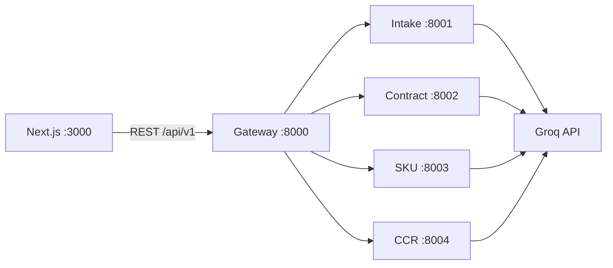

# PRS AI Hub — End-to-End Guide

This document explains **what the system is**, **how to run it**, and **what each part does** so you can demo or implement it from scratch.

---

## 1. What is this?

**PRS AI Hub** is a healthcare procurement validation MVP. A user submits a **Purchase Request System (PRS)** package: requestor info, vendor info, a **contract** (full text), and an optional **SKU schedule** (line items + addendum policies). Seven AI agents validate different sections and return structured JSON (`pass` / `partial` / `fail`). A **gateway** orchestrates the agents and stores results.

A separate **enterprise pipeline** (test data from Excel workbooks) models a longer Vizient-style flow: intake → contract intelligence → **CCR** (contract compliance review per invoice) → cash reconciliation → exceptions → supplier comms. Only **PRS submit (7 agents)** and **CCR evaluate** are fully wired to Groq today; Enterprise is mainly a **data browser** plus CCR batch UI.

---

## 2. Repository layout

```
ai-hub/                          # Parent repo (design data + specs)
├── AGENTS.md                      # Agent prompts & JSON schemas (source of truth)
├── data/                          # Raw sample inputs (not inside prs-ai-hub)
│   ├── Contract intelligence/     # 5 contract .txt files
│   ├── *.xlsx                     # 6 enterprise workbooks (intake, CCR, cash, …)
│   └── …
└── prs-ai-hub/                    # Runnable application ← start here
    ├── explanation.md             # This file
    ├── QUICKSTART.md              # Short run commands
    ├── .env                       # Your secrets (create from .env.example)
    ├── frontend/                  # Next.js UI (:3000)
    ├── backend/
    │   ├── gateway/               # API + orchestrator (:8000)
    │   ├── agents/
    │   │   ├── intake/            # Requestor + vendor (:8001)
    │   │   ├── contract/          # Parties, commercial, legal (:8002)
    │   │   ├── sku/               # Schedule + policy (:8003)
    │   │   └── ccr/               # Invoice vs contract decision (:8004)
    │   └── shared/                # Shared Groq client (retries, fallbacks)
    ├── shared/prs_models/         # Pydantic models shared across services
    ├── scripts/                   # Setup, run, sync, fixtures
    └── data/
        ├── contracts/             # Copies/symlinks of contract .txt for fixtures
        ├── fixtures/              # Pre-built submit payloads (JSON)
        └── enterprise/            # JSON synced from parent data/*.xlsx
```

---

## 3. Architecture (runtime)



### PRS validation flow (7 agents)

When you click **Submit for validation**, the gateway runs a **LangGraph** pipeline in three phases:

| Phase | Agents | Runs |
|-------|--------|------|
| 1 — Intake | Requestor info, Vendor info | In parallel |
| 2 — Contract | Parties & definitions, Commercial terms, Legal clauses | **Sequential** (Groq rate limits) |
| 3 — SKU | SKU schedule, SKU policy | In parallel |

Each agent is a small **FastAPI** service that calls **Groq** (`llama-3.3-70b-versatile` with fallbacks) and returns JSON only (no markdown). The gateway merges results into `overall_status`, `critical_blockers`, `warnings`, and per-agent `agent_results`.

### CCR flow (separate from PRS submit)

**CCR** = “should this invoice be paid under this contract?” One row from `ccr_decision_input_may2026.xlsx` → gateway loads matching contract text → CCR agent on :8004 → decision JSON.

### Enterprise page

**Does not run agents** (except via link to `/ccr`). It reads `data/enterprise/*.json` produced by `sync_enterprise_data.py` and shows tables + pipeline context.

---

## 4. What each agent does

| # | Agent | Service | Input | Validates |
|---|--------|---------|--------|-----------|
| 1 | Requestor info | Intake :8001 | Form fields (name, BU, priority, description, need-by date) | PRS intake requestor section |
| 2 | Vendor info | Intake :8001 | Vendor address, contact, IDs | Vendor data quality |
| 3 | Parties & definitions | Contract :8002 | `contract_text` | Legal names, addresses, defined terms |
| 4 | Commercial terms | Contract :8002 | `contract_text` | Scope, payment, term/termination |
| 5 | Legal clauses | Contract :8002 | `contract_text` | IP, indemnity, liability cap, governing law, etc. |
| 6 | SKU schedule | SKU :8003 | `sku_items[]` | Per-line SKU pricing, UOM, MOQ, lead time, status |
| 7 | SKU policy | SKU :8003 | `addendum_text` | Pricing policies, recalls, commitments in addendum |
| — | CCR decision | CCR :8004 | Transaction row + contract text | PASS / HOLD / REJECT style invoice decision |

Full prompts and output schemas: `../AGENTS.md` (repo root) or `docs/AGENTS.md`.

---

## 5. Data: what file does what

### A. Contract intelligence (`ai-hub/data/Contract intelligence/`)

| File | Scenario |
|------|----------|
| `C-2024-001_apextech_supply.txt` | Clean contract — expect mostly **pass** |
| `C-2023-029_vertex_ambiguous.txt` | Vague clauses — **partial** |
| `C-2023-015_stratagem_services.txt` | Milestone payments — **partial** |
| `C-2022-008_primeservice_facilities.txt` | SLA-heavy facilities — **pass** |
| `C-2019-003_vortex_expired.txt` | Expired dates — **fail** |

Used by: PRS fixtures, CCR (lookup by `contract_number`), contract agent input.

### B. Sample fixtures (`prs-ai-hub/data/fixtures/`)

Pre-filled **submit payloads** (requestor + vendor + contract + `sku_items` + addendum). Generated from contracts via:

```bash
cd prs-ai-hub
python scripts/generate_fixtures.py
```

Edit `scripts/generate_fixtures.py` → `SCENARIOS[*].sku_items` to add more SKU rows, then re-run.

### C. Enterprise workbooks (`ai-hub/data/*.xlsx`)

| Workbook | Purpose in full pipeline |
|----------|---------------------------|
| `vizient_prs_intake_agent_may0519.xlsx` | Many invoice/submission rows + known issues + rules |
| `ccr_decision_input_may2026.xlsx` | Per-transaction CCR decisions (20 rows) |
| `Cash_reconciliation_input_0519.xlsx` | Invoices vs bank payments |
| `orchestrator_workflow_inputFile_0519.xlsx` | Workflow stages, handoffs, SLAs |
| `exception_resolution_inputFile_0519.xlsx` | Exception queue |
| `supplier_interaction_inputFile_0519.xlsx` | Supplier email/message queue |
| `learning_evaluation_InputFile_0519.xlsx` | Human overrides for prompt tuning |

Sync into the app:

```bash
cd prs-ai-hub
python scripts/sync_enterprise_data.py
```

Output: `data/enterprise/*.json` + `manifest.json` (metadata for `/enterprise` UI).

---

## 6. How to run end-to-end (local)

### Prerequisites

- Python 3.11+
- Node.js 20+
- [Groq API key](https://console.groq.com)
- Optional: Docker for Postgres/Redis (app can use SQLite locally)

### Step 1 — One-time setup

```bash
cd prs-ai-hub
chmod +x scripts/*.sh
./scripts/setup_venv.sh
cp .env.example .env
# Edit .env: set GROQ_API_KEY=gsk_...
```

### Step 2 — Sync enterprise data (optional but needed for /enterprise and /ccr)

```bash
source .venv/bin/activate
python scripts/sync_enterprise_data.py
```

### Step 3 — Start backend (all agents + gateway)

**Option A — everything including frontend:**

```bash
./scripts/run_all.sh
```

**Option B — backend only:**

```bash
./scripts/run_backend.sh
# Then in another terminal:
cd frontend && npm install && npm run dev
```

| Port | Service |
|------|---------|
| 3000 | Next.js frontend |
| 8000 | Gateway (API docs: `/docs`) |
| 8001 | Intake agent |
| 8002 | Contract agent |
| 8003 | SKU agent |
| 8004 | CCR agent |

### Step 4 — Use the UI

| URL | What to do |
|-----|------------|
| http://localhost:3000 | Dashboard — submission history |
| http://localhost:3000/submit | Load a **sample fixture** → **Submit for validation** → watch 7 agents |
| http://localhost:3000/results/{id} | Per-agent JSON, bullet summaries, SKU table |
| http://localhost:3000/enterprise | Browse synced workbook data |
| http://localhost:3000/ccr | **Evaluate** CCR transactions one by one |
| http://localhost:8000/docs | Swagger — all REST endpoints |

Typical PRS demo (~1–2 minutes): Submit → ApexTech Clean → Results page streams agent completion via WebSocket.

---

## 7. UI pages → API → backend

| Page | Main API calls | Backend behavior |
|------|----------------|------------------|
| Dashboard / History | `GET /api/v1/prs/history` | Lists stored submissions (SQLite/Postgres) |
| Submit | `GET /api/v1/fixtures`, `POST /api/v1/prs/submit` | Starts orchestrator; returns `request_id` |
| Results | `GET /api/v1/prs/{id}`, WebSocket progress | Reads merged agent results |
| Delete row | `DELETE /api/v1/prs/{id}` | Removes submission from DB |
| Enterprise | `GET /api/v1/enterprise/manifest`, `GET .../datasets/{id}` | Serves synced JSON |
| CCR | `GET /api/v1/ccr/transactions`, `POST .../evaluate` | Calls CCR agent + contract file lookup |

---

## 8. Implementation map (where to change what)

| Goal | Where to look |
|------|----------------|
| Change agent rules / JSON shape | `AGENTS.md`, then `backend/agents/*/prompts/` |
| Groq model, retries, fallbacks | `backend/shared/groq_client.py` |
| Orchestration order / merge logic | `backend/gateway/orchestrator/graph.py` |
| REST routes (PRS, fixtures, CCR, enterprise) | `backend/gateway/routers/` |
| Persist submissions | `backend/gateway/services/database.py` |
| Submit form & SKU table | `frontend/app/submit/page.tsx`, `components/SkuSchedulePanel.tsx` |
| Results layout | `frontend/app/results/[id]/page.tsx`, `components/AgentDetailCard.tsx` |
| Add fixture SKUs / scenarios | `scripts/generate_fixtures.py` |
| Add enterprise Excel sheets | `scripts/sync_enterprise_data.py` + parent `ai-hub/data/` |
| CCR prompt | `backend/agents/ccr/prompts/ccr.py` |
| Env vars | `.env.example` |

---

## 9. Environment variables (important)

| Variable | Purpose |
|----------|---------|
| `GROQ_API_KEY` | Required for all LLM calls |
| `GROQ_MODEL` | Primary model (default: `llama-3.3-70b-versatile`) |
| `GROQ_FALLBACK_MODELS` | Comma-separated fallbacks on 429/errors |
| `GROQ_MAX_TOKENS` | Max tokens per call (contract agents need headroom) |
| `INTAKE_AGENT_URL` … `CCR_AGENT_URL` | Gateway → agent service URLs |
| `DATABASE_URL` | Postgres or `sqlite+aiosqlite:///.../prs_local.db` |
| `CONTRACT_INTELLIGENCE_DIR` | Folder for CCR contract lookup (default: `../data/Contract intelligence`) |
| `NEXT_PUBLIC_API_URL` | Frontend → gateway (default `http://localhost:8000`) |

---

## 10. Two “modes” of the product (don’t confuse them)

| Mode | Unit of work | Agents run |
|------|----------------|------------|
| **PRS Hub submit** | One form submission (`request_id`) | All 7 agents on one contract + SKU list |
| **Enterprise pipeline** | Many rows per Excel workbook | Only **CCR evaluate** is live; rest is browse-only test data |

Dashboard **history rows** = PRS submissions, **not** one row per enterprise Excel line.

---

## 11. Extending the system

1. **More SKU in demos** — Edit `generate_fixtures.py`, run script, reload fixture on Submit.
2. **New contract scenario** — Add `.txt` under `Contract intelligence/`, add scenario in `generate_fixtures.py`, copy contract into `prs-ai-hub/data/contracts/`.
3. **New enterprise sheet** — Add xlsx under `ai-hub/data/`, extend `sync_enterprise_data.py`, add dataset entry in manifest generation, optional new router/UI tab.
4. **New agent** — New FastAPI app under `backend/agents/`, prompt file, gateway router + orchestrator node (or separate page like CCR).
5. **Batch intake validation** — Loop `intake_submissions.json` → map rows to requestor agent payload → new UI on Enterprise.

---

## 12. Troubleshooting

| Symptom | Likely cause | Fix |
|---------|----------------|-----|
| Blank white page on :3000 | Corrupt `.next` cache | `cd frontend && rm -rf .next && npm run dev` |
| `Cannot find module './NNN.js'` | Same | Clear `.next` |
| Enterprise **404** | Gateway started before enterprise routes existed | Restart gateway (`run_backend.sh` or kill :8000 and restart) |
| Contract agent **500** / rate limit | Groq daily/token limit on 70B | Wait or use fallbacks in `.env`; contract agents already run sequentially |
| CCR / agents slow | Groq fallback chain | Normal; check gateway logs for `succeeded with fallback` |
| `/enterprise` empty | Sync not run | `python scripts/sync_enterprise_data.py` |
| Fixture missing SKUs | Old JSON | `python scripts/generate_fixtures.py` |

---

## 13. Docker (optional full stack)

```bash
cd prs-ai-hub
docker compose up --build
```

See `QUICKSTART.md` for service URLs. Local `.venv` path is usually faster for development.

---

## 14. Quick reference — scripts

| Script | Purpose |
|--------|---------|
| `scripts/setup_venv.sh` | Create Python venv + install deps |
| `scripts/start_infra.sh` | Postgres + Redis (Docker) |
| `scripts/run_backend.sh` | Gateway + 4 agent services |
| `scripts/run_all.sh` | Backend + `npm run dev` frontend |
| `scripts/generate_fixtures.py` | Build `data/fixtures/*.json` from contracts |
| `scripts/sync_enterprise_data.py` | Excel → `data/enterprise/*.json` |

---

## 15. One-paragraph elevator pitch

**PRS AI Hub** takes a procurement submission (who’s asking, which vendor, full contract text, SKU line items), runs **seven specialized Groq-powered validators**, and returns a merged pass/fail report with blockers and warnings. **Sample fixtures** and **contract files** provide realistic healthcare scenarios; **enterprise Excel data** shows the broader Vizient automation pipeline, with **CCR** as the first batch agent beyond the core PRS form. Run `./scripts/run_all.sh`, open Submit, load ApexTech Clean, and submit — that’s the full MVP loop.

For agent JSON schemas and prompt text, always refer to **`AGENTS.md`** at the repository root.
